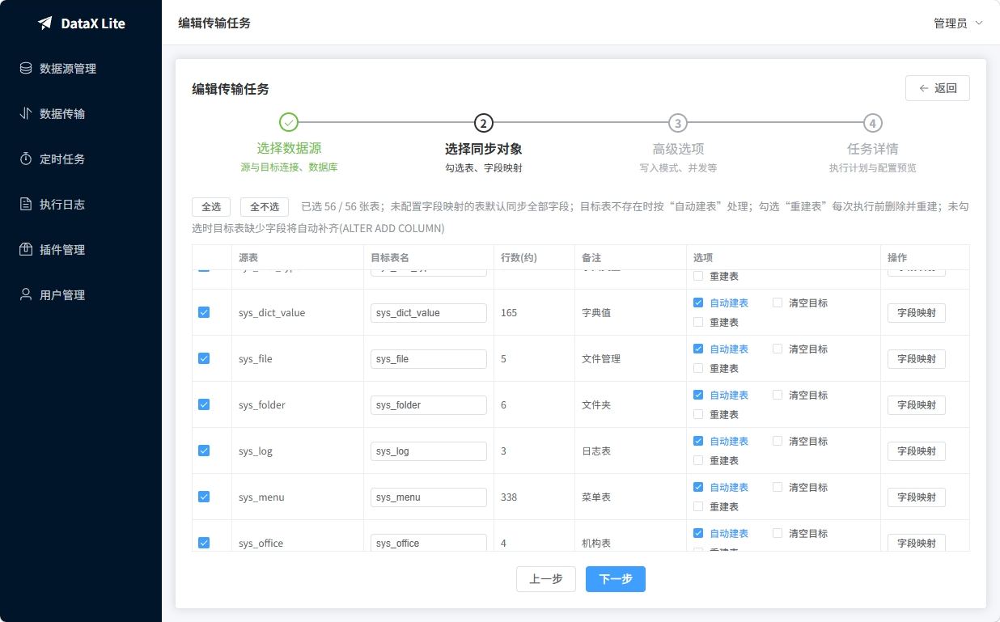
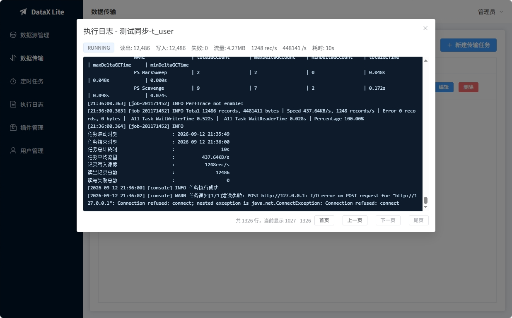

<div align="center">

# DataX Lite

基于 [DataX](https://github.com/alibaba/DataX) 开发的 **轻量化** 数据同步工具。
开箱即用，无需Docker、Python、额外数据库消息队列或调度组件，通过web界面选择源库、目标库、表，即可整库/整表完成全量同步。

**本工具仅支持 MySQL > MySQL 库间对拷** 

</div>


## 快速开始

运行环境：JDK8、JDK21

从 Releases 下载预构建包或从源码编译

```bash
java -jar datax-lite.jar
```

启动后访问 <http://localhost:8001>，默认管理员账号：`admin` / `admin123`（首次启动自动创建，可在配置文件中修改）。

## 配置说明

主要配置见 `console/src/main/resources/application.yml`：

- `server.port`：服务端口，默认 `8001`
- `datax-console.max-concurrent-jobs`：最大同时执行任务数，默认 `3`
- `datax-console.auth.secret`：JWT 签名密钥，**务必修改**
- `datax-console.auth.init-admin`：用户表为空时自动初始化的管理员账号


## 执行流程

一次同步任务的执行分为 **准备阶段**、**DataX 数据传输阶段** 和 **恢复阶段**：准备阶段全部完成后才开始数据传输，数据传输全部成功后才进入恢复阶段。

### 阶段一：表结构准备

先集中处理任务涉及的所有目标表，按配置执行新建 / 重建 / 修改：

| 配置 | 准备动作 |
| --- | --- |
| 勾选「重建表」 | 目标表存在则 `DROP TABLE`，再按源表结构 `CREATE TABLE` |
| 目标表不存在 + 勾选「自动建表」 | 按源表结构 `CREATE TABLE` |
| 目标表已存在 | 比对映射字段，缺失的列用 `ALTER TABLE ... ADD COLUMN` 补齐（只增不删，目标表多出的字段不受影响） |
| 目标表不存在且未勾选「自动建表」 | 不建表，执行写入时会失败（界面上会给出警告） |

同时按「表结构复制选项」处理目标表上的外键与触发器：

- **包含外键约束**（默认不勾选）：新建表剥离外键；目标表已存在的外键先移除，待恢复
- **移除触发器**（默认勾选）：目标表已存在的触发器先移除，避免写入期间逐行触发改变数据
- **残留拦截**：目标表已存在外键但未勾选「包含外键约束」，或已存在触发器但未勾选「移除触发器」时，准备阶段直接报错退出，不会带着隐患进入数据传输

任何准备动作失败都会直接报错退出，不进入数据传输阶段。任务预览的准备计划与本阶段由同一套逻辑生成，所见即所执行。

字段级别的设置只对「自动建表」「重建表」「缺失补齐」触发时才生效。

### 阶段二：DataX 执行数据传输

DataX 逐批读取源表数据写入目标表。写入期间目标表上没有外键、也没有触发器——多线程乱序写入不会触发外键冲突，写入动作也不会被触发器改变。

### 阶段三：恢复

数据传输全部成功后，按「表结构复制选项」在计划末尾统一执行恢复动作，顺序固定：

| 动作 | 对应选项 | 说明 |
| --- | --- | --- |
| 统一恢复外键 | 包含外键约束 | 按源表定义执行 `ALTER TABLE ... ADD CONSTRAINT`；父表不在任务范围且目标库不存在时，准备阶段已拦截报错 |
| 重建触发器 | 重建触发器（默认不勾选） | 按源表定义重建（含源库没有同名的目标独有触发器）；仅勾选「移除触发器」时，目标触发器同步后保持移除状态 |
| 对齐自增计数器 | 对齐自增计数器（默认勾选） | `ALTER TABLE ... AUTO_INCREMENT = n` 对齐为源表快照值；MySQL 只向上调整，幂等安全，覆盖「清空目标」重置计数器的场景 |

恢复阶段失败时任务标记为失败，但**数据已同步完成**，日志会明确提示；此时表数据完整，仅外键 / 触发器 / 自增计数器未恢复。任务在恢复前被手动停止则跳过恢复，下次执行的准备阶段会自动按同样逻辑重入（先移除再恢复）。

## 特别注意

- 准备阶段是**先集中处理整个任务的所有表**，全部处理完才进入传输。这意味着**如果勾选了「清空」「重建表」，目标库中该任务包含的所有表会在数据传输开始前就被清空**。
- 由于各阶段前后相继，若任务在传输途中失败或被手动停止，已重建 / 已清空的表会处于空表或数据不完整的状态；若在恢复阶段失败，数据已完整，仅外键 / 触发器 / 自增计数器未恢复。请确认目标库可以接受该风险，重要数据请先备份。

 

## 预览






