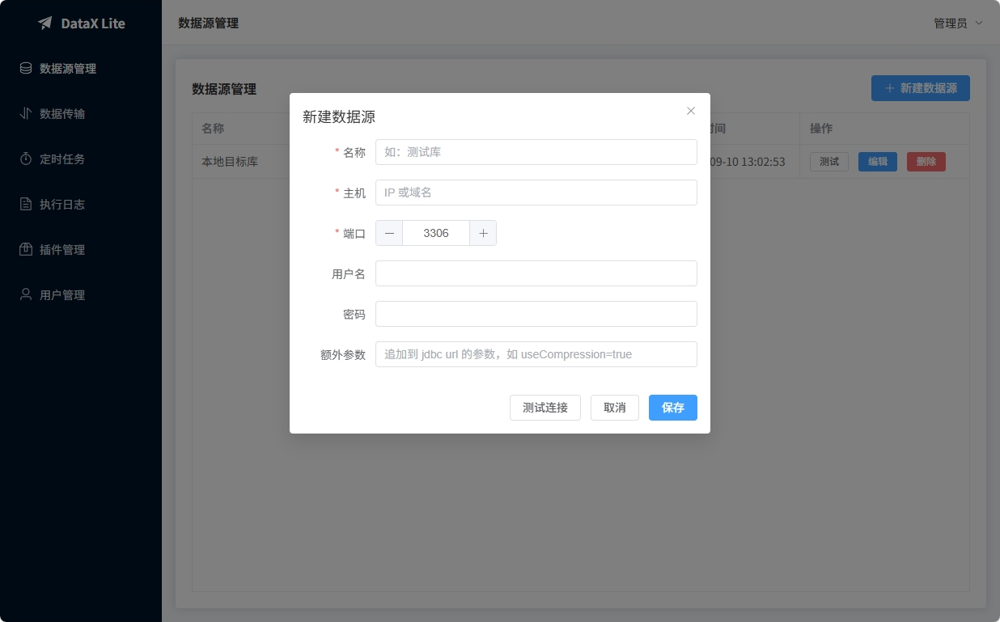
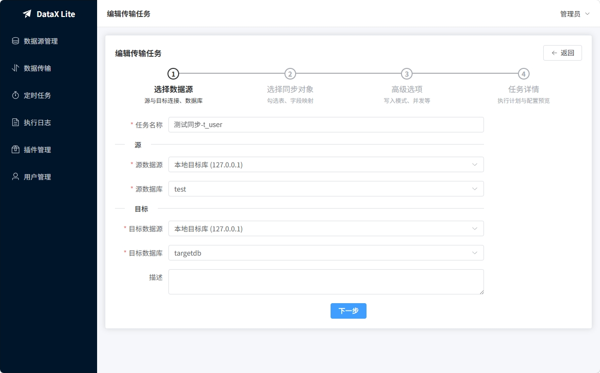
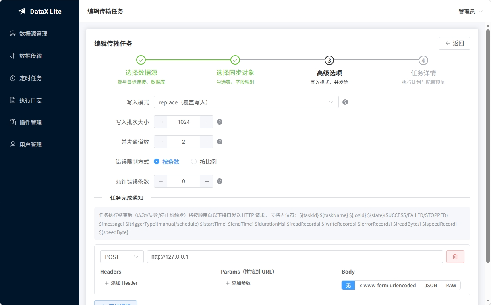
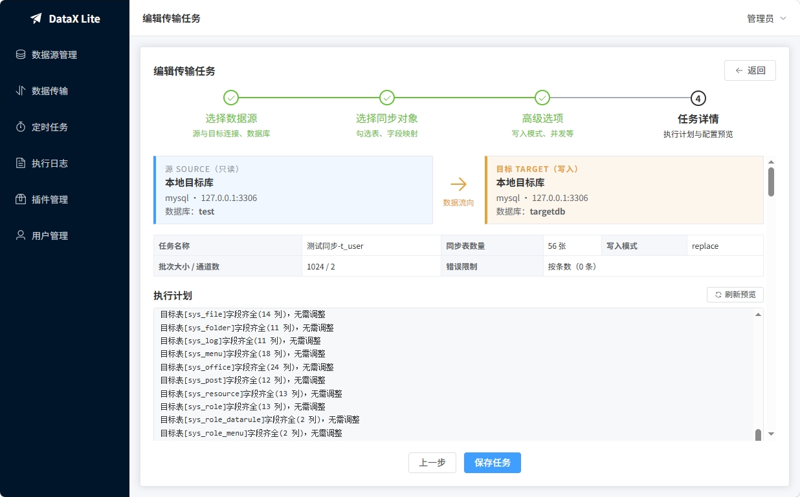
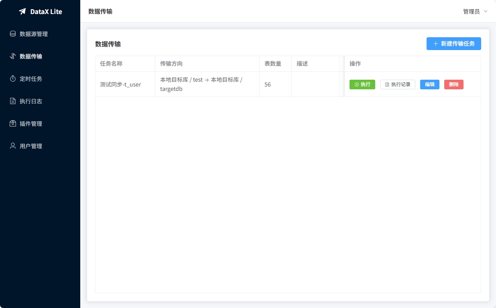

# DataX Lite 操作指南

本指南介绍平台的主要功能与操作流程。系统启动后浏览器访问 <http://localhost:8001>，使用管理员账号登录（默认账号密码于配置文件设置）。

> ⚠️ **操作前须知**
>
>  本工具基于 DataX 二次开发，适合本地、开发环境或测试环境中的短期、非重要数据同步。它并非为在服务器上长期稳定运行而设计，请勿用于生产环境、承载线上业务、处理敏感数据或重要的高价值数据。生产环境请使用 DataX 官方发行版本。
>  
>  数据库对拷属于高风险操作。本工具不可避免的会对库表数据进行修改删除操作，若操作不当或执行中途失败，可能造成不可逆的数据丢失。使用本工具前请务必先同时备份源端与目标端，并在测试环境完成充分验证。

---

## 一、数据源管理

用于维护 MySQL 连接信息，是创建同步任务的前提。

1. 进入「数据源管理」，点击右上角 **新建数据源**。
2. 填写名称、主机、端口、用户名、密码（额外参数可留空）。
3. 点击 **测试连接** 确认可用后 **保存**。

---

## 二、新建传输任务

进入「数据传输」，点击 **新建传输任务**，按四步向导完成配置。

### 第 1 步：选择数据源

填写任务名称，选择 **源** 的数据源与数据库、**目标** 的数据源与数据库，可补充描述，点击「下一步」。

### 第 2 步：选择同步对象

- 勾选需要同步的表（支持全选/全不选），已选表可修改目标表名。
- 每张表的「选项」可设置是否 **自动建表**、**清空目标**、**重建表**。这三项都会在任务执行时生效，具体时机见下文「执行的两个阶段」。
- 点击 **字段映射** 可自定义源字段与目标字段的对应关系；未配置时默认按同名字段同步全部字段。
- 目标表不存在且勾选「自动建表」时自动创建；选择「重建表」则每次执行前删除并重建。

### 第 3 步：高级选项

按需调整运行参数（一般保持默认）：

- **写入模式**：`replace`（一般使用覆盖）/ `insert` 等
- **写入批次大小**：默认 1024
- **并发通道数**：默认 2，可提高同步速度
- **错误限制**：按条数或按比例，超过阈值任务失败
- **任务完成通知**：可配置任务结束后回调的 HTTP 接口，支持 `${taskId}`、`${state}`、`${readRecords}` 等占位符

### 第 4 步：任务详情

确认源/目标信息、参数汇总，点击 **刷新预览** 可查看执行计划（如各目标表字段差异与自动补齐提示）。确认无误后 **保存任务**。

---

## 三、执行任务与查看日志

在「数据传输」列表中，点击任务行的 **执行** 即可手动运行。

运行过程中会弹出日志窗口，实时显示执行状态、读出/写入条数、流量、耗时以及 DataX 原始日志，可在此停止任务。

任务的历史记录同样保留在「执行日志」菜单中，可按任务查询。

## 执行的两个阶段

一次同步任务的执行分为 **准备阶段** 和 **DataX 执行阶段**，准备阶段全部完成后才会开始数据传输。

### 阶段一：表结构准备阶段

先集中处理任务涉及的所有目标表，按配置执行新建 / 重建 / 修改：

| 配置 | 准备动作 |
| --- | --- |
| 勾选「重建表」 | 目标表存在则 `DROP TABLE`，再按源表结构 `CREATE TABLE` |
| 目标表不存在 + 勾选「自动建表」 | 按源表结构 `CREATE TABLE` |
| 目标表已存在 | 比对映射字段，缺失的列用 `ALTER TABLE ... ADD COLUMN` 补齐（只增不删，目标表多出的字段不受影响） |
| 目标表不存在且未勾选「自动建表」 | 不建表，执行写入时会失败（界面上会给出警告） |

字段级别的设置只对「自动建表」「重建表」「缺失补齐」触发时才生效。

### 阶段二：DataX 执行数据传输 逐批填充数据

 

## 特别注意

- 准备阶段是**先集中处理整个任务的所有表**，全部处理完才进入传输。这意味着**如果勾选了「清空」「重建表」，目标库中该任务包含的所有表会在数据传输开始前就被清空**。
- 由于准备与传输是两个前后阶段，若任务在传输途中、任务失败或被手动停止，已重建 / 已清空的表会处于空表或数据不完整的状态。请确认目标库可以接受该风险，重要数据请先备份。

 

---

## 四、定时任务

进入「定时任务」，点击 **新建定时任务**：

1. 填写任务名，选择要执行的 **同步任务**。
2. 输入 **cron 表达式**（6 位，如 `0 0/30 * * * ?` 表示每 30 分钟执行一次），点击 **校验** 可预览接下来的执行时间。
3. 保存后列表中用开关控制启用/停用。

列表中支持 **立即执行**（跳过调度直接跑一次）与 **执行记录**（查看历史运行结果）。

 
